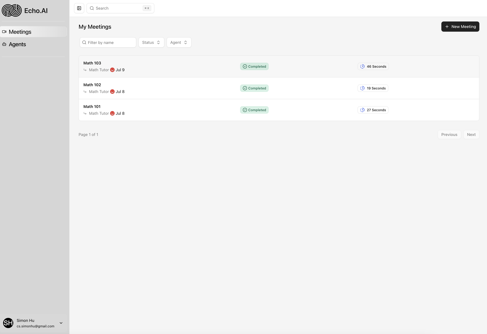
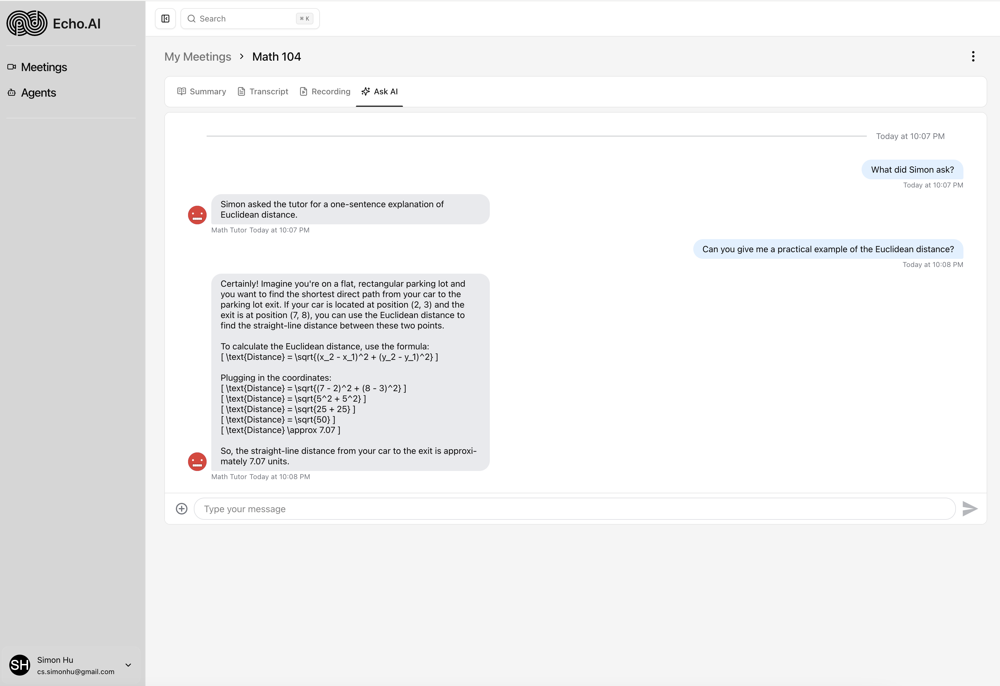
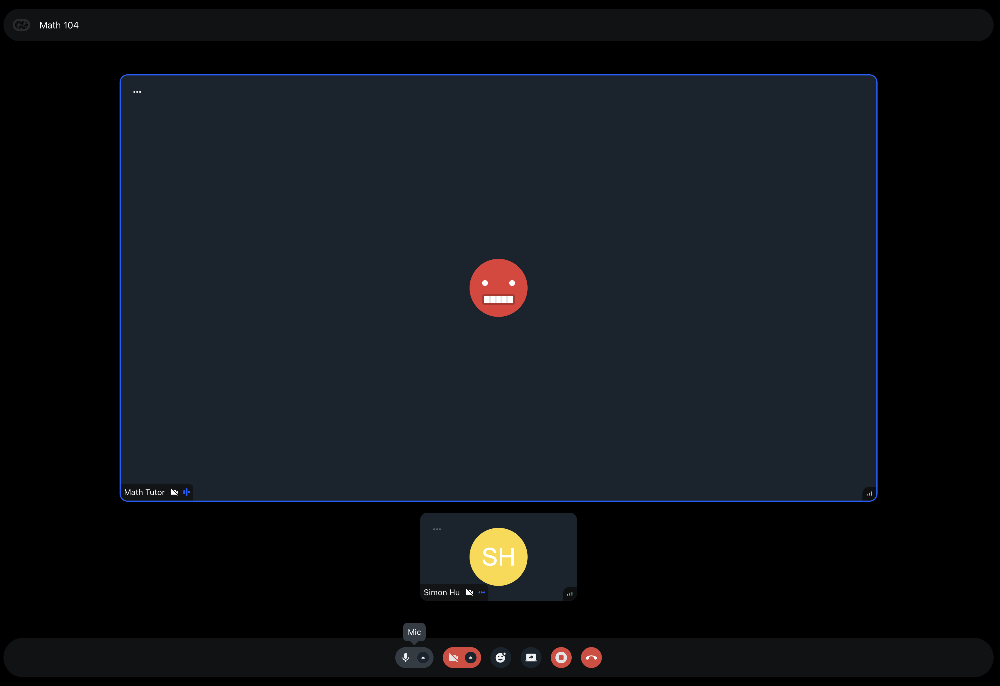
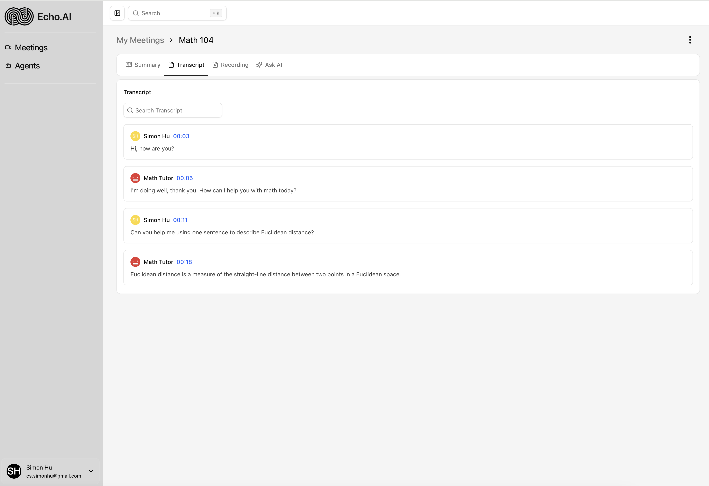
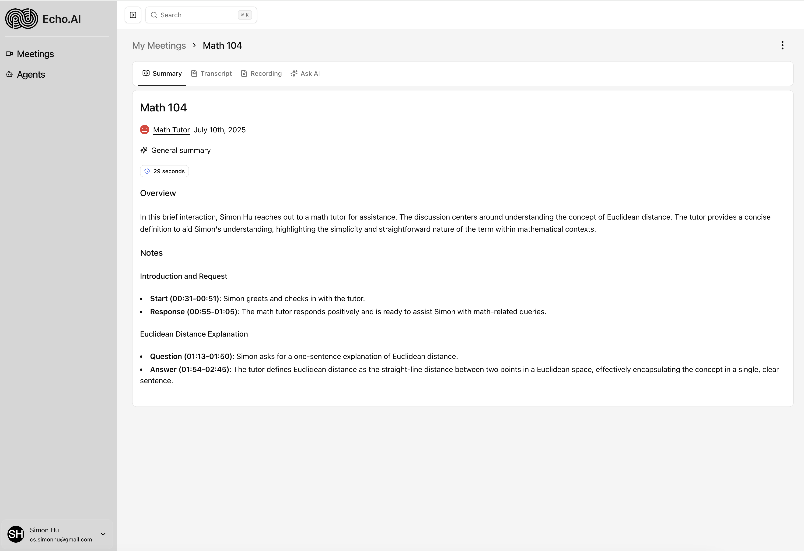
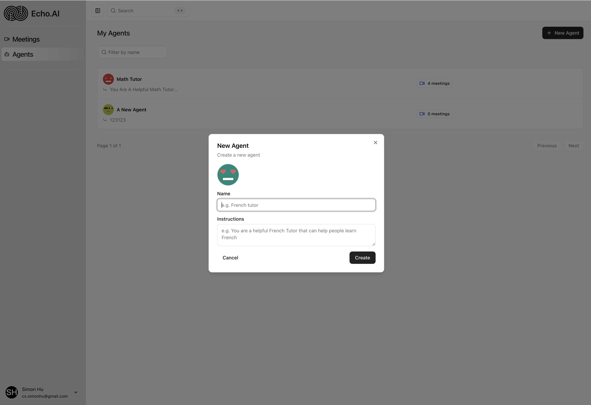

# Echo.AI

A modern AI-powered video meeting platform that enables intelligent conversations with AI agents. Create custom AI agents, schedule meetings, and have natural video conversations with real-time transcription and AI-powered summaries.

## 🚀 Live Demo

Visit the deployed application at: **[echoai-sigma.vercel.app](https://echoai-sigma.vercel.app)**

## 📸 Screenshots

<div align="center">
  
  <p><em>Main dashboard with meetings and agents overview</em></p>
</div>

<div align="center">
  
  
  <p><em>Real-time chat and recording interface</em></p>
</div>

<div align="center">
  
  
  <p><em>Recording transcript and AI-generated meeting summary</em></p>
</div>

<div align="center">
  
  <p><em>Custom AI agent builder interface</em></p>
</div>
## ✨ Features

- **AI Agent Management**: Create and customize AI agents with specific instructions and personalities
- **Video Meetings**: High-quality video calls with AI agents using Stream Video
- **Real-time Transcription**: Live transcription during meetings with speaker identification
- **AI-Powered Summaries**: Automatic meeting summaries generated using OpenAI GPT-4
- **Meeting Management**: Schedule, join, and manage meetings with different statuses
- **User Authentication**: Secure authentication with email/password and social providers (GitHub, Google)
- **Modern UI**: Beautiful, responsive interface built with Radix UI and Tailwind CSS

## 🛠️ Tech Stack

### Frontend
- **Next.js 15** - React framework with App Router
- **React 19** - UI library
- **TypeScript** - Type safety
- **Tailwind CSS 4** - Utility-first CSS framework
- **Radix UI** - Accessible component primitives
- **Lucide React** - Icon library

### Backend & API
- **tRPC** - End-to-end typesafe APIs
- **Next.js API Routes** - Server-side API endpoints
- **Better Auth** - Authentication library
- **Zod** - Schema validation

### Database
- **PostgreSQL** - Primary database
- **Drizzle ORM** - Type-safe database toolkit
- **Neon** - Serverless PostgreSQL

### Real-time & AI
- **Stream Video** - Video calling infrastructure
- **Stream Chat** - Real-time messaging
- **OpenAI GPT-4** - AI agent conversations and summaries
- **Inngest** - Background job processing

### Development Tools
- **ESLint** - Code linting
- **Prettier** - Code formatting
- **Drizzle Kit** - Database migrations and studio

## 🚀 Getting Started

### Prerequisites

- Node.js 18+ 
- PostgreSQL database
- OpenAI API key
- Stream Video API key
- GitHub/Google OAuth credentials (optional)

### Environment Variables

Create a `.env.local` file with the following variables:

```env
# Database
DATABASE_URL="postgresql://..."

# Authentication
GITHUB_CLIENT_ID=""
GITHUB_CLIENT_SECRET=""
GOOGLE_CLIENT_ID=""
GOOGLE_CLIENT_SECRET=""

# OpenAI
OPENAI_API_KEY=""

# Stream Video
NEXT_PUBLIC_STREAM_VIDEO_API_KEY=""
STREAM_VIDEO_API_SECRET=""

# Inngest
INNGEST_EVENT_KEY=""
INNGEST_SIGNING_KEY=""
```

### Installation

1. Clone the repository:
```bash
git clone https://github.com/yourusername/echoai.git
cd echoai
```

2. Install dependencies:
```bash
npm install
```

3. Set up the database:
```bash
npm run db:push
```

4. Start the development server:
```bash
npm run dev
```

5. Open [http://localhost:3000](http://localhost:3000) in your browser.

## 📁 Project Structure

```
src/
├── app/                    # Next.js App Router pages
│   ├── (auth)/            # Authentication pages
│   ├── (dashboard)/       # Main application pages
│   └── api/               # API routes
├── components/            # Reusable UI components
├── db/                    # Database schema and connection
├── hooks/                 # Custom React hooks
├── inngest/               # Background job functions
├── lib/                   # Utility functions and configurations
├── modules/               # Feature-based modules
│   ├── agents/           # AI agent management
│   ├── auth/             # Authentication
│   ├── call/             # Video calling
│   ├── dashboard/        # Dashboard components
│   ├── home/             # Home page
│   └── meetings/         # Meeting management
└── trpc/                 # tRPC configuration and routers
```

<!-- ## 🔧 Available Scripts

- `npm run dev` - Start development server
- `npm run build` - Build for production
- `npm run start` - Start production server
- `npm run lint` - Run ESLint
- `npm run db:push` - Push database schema changes
- `npm run db:studio` - Open Drizzle Studio -->

## 🚀 Deployment

The application is deployed on Vercel at **[echoai-sigma.vercel.app](https://echoai-sigma.vercel.app)**.

<!-- ### Deploy to Vercel

1. Push your code to GitHub
2. Connect your repository to Vercel
3. Configure environment variables in Vercel dashboard
4. Deploy! -->

<!-- <!-- ## 🤝 Contributing

1. Fork the repository
2. Create a feature branch (`git checkout -b feature/amazing-feature`)
3. Commit your changes (`git commit -m 'Add some amazing feature'`)
4. Push to the branch (`git push origin feature/amazing-feature`)
5. Open a Pull Request -->

## 📄 License

This project is licensed under the MIT License - see the [LICENSE](LICENSE) file for details. 

## 🙏 Acknowledgments

- [Stream](https://stream.io/) for video calling infrastructure
- [OpenAI](https://openai.com/) for AI capabilities
- [Vercel](https://vercel.com/) for hosting and deployment
- [Next.js](https://nextjs.org/) for the amazing framework
- Special thanks to [Cursor AI](https://www.cursor.so/) for providing an outstanding AI coding assistant that greatly accelerated the development process.
